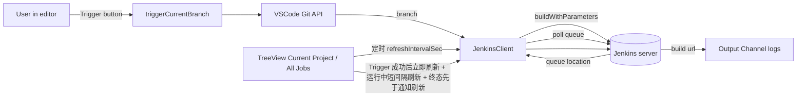

# VSCode Jenkins Builder 插件 — 需求文档

技术设计与架构见 [TECHNICAL_DESIGN.md](./TECHNICAL_DESIGN.md)。

## 1. 背景与目标

打造一个比 Jenkins 官方 Workbench 插件更轻的 IDE 内置面板，聚焦在“看自己关心的 Job + 一键基于当前分支触发构建”两件事，并且要能在 Cursor 的扩展市场中安装。

主要使用场景：开发同学在 VSCode/Cursor 里写完代码、切到测试分支后，无需切到浏览器即可触发当前项目对应的测试环境 Jenkins Job、看日志、必要时停止构建。

## 2. 运行环境与发布渠道

- 宿主：VSCode `^1.85.0` 及以上（Cursor 内核兼容此版本）
- 脚手架：基于 [antfu/starter-vscode](https://github.com/antfu/starter-vscode)
  - 包管理：`pnpm`
  - 打包：`tsup`（自带 watch）
  - 框架：`reactive-vscode`（Vue Composition-style 包装 VSCode API，配 `defineExtension`/`useCommand`/`useStatusBarItem` 等）
  - Lint：`@antfu/eslint-config`
  - 调试：脚手架自带 `.vscode/launch.json` 的 `Run Extension`
- 发布：
  - VS Code Marketplace：`vsce publish`
  - Open VSX Registry（Cursor 默认的扩展源）：`ovsx publish`
  - `package.json` 的 `engines.vscode`、`categories`、`keywords`、`icon`、`repository` 必填，确保两个市场的展示与可搜索性

## 3. 核心功能需求

### 3.1 登录与全局配置

- 仅支持 **单个 Jenkins 服务器**，配置项放在 VSCode Settings：
  - `jenkinsBuilder.baseUrl`：例如 `https://jenkins.example.com`
  - `jenkinsBuilder.username`：Jenkins 用户名
  - `jenkinsBuilder.apiToken`：API Token，**通过 `vscode.SecretStorage` 持久化**，不写入 `settings.json`
- 提供命令 `Jenkins Builder: Sign In`，弹 InputBox 引导填写以上三项；成功后调用 `GET /me/api/json` 校验
- 提供命令 `Jenkins Builder: Sign Out`，清空 SecretStorage 中的 token
- 状态栏左下角显示当前登录用户名/未登录状态；点击触发登录命令

### 3.2 侧边栏：Activity Bar 容器

新增一个 Activity Bar 图标 `Jenkins`，下面两个 TreeView：

#### View A：`Current Project`

- 展示当前 workspace 在 `.vscode/settings.json` 中绑定的 Job
- 项目级配置字段：`jenkinsBuilder.projectJob`（string，存 Job full name，如 `team-a/folder/my-service`）
- 若未绑定：显示一个 "Bind Jenkins Job…" 节点，点击后弹 QuickPick（来自 View B 的全量 Job 列表）让用户挑选并写回 `.vscode/settings.json`
- 已绑定时，节点结构：

```text
<Job Name>  [last build status icon]
├─ #128  SUCCESS   2m13s  by liang.hong
├─ #127  FAILURE   1m44s  by liang.hong
└─ #126  ABORTED   0m32s  by ci
```

#### View B：`All Jobs`

- 顶部一个搜索框（`TreeView` 的 message 区或一个 placeholder item，点击后用 QuickPick 输入关键字）
- 拉取当前用户有权限看到的所有 Job：`GET /api/json?tree=jobs[name,fullName,url,color]`，对 folder 递归展开（懒加载子节点）
- 每个 Job 节点展开后同样列出最近 N 次（默认 10）build

### 3.3 Build 节点交互

侧边栏每个 Build 节点支持的操作（MVP 范围）：

- **查看日志**：单击 build 节点或右键 "View Console Log"，在 VSCode Output Channel `Jenkins: <jobName> #<n>` 中流式拉取 `consoleText`；运行中状态使用 `progressiveText` 增量轮询
- **停止构建**：仅在 build 处于运行中时可见，右键 "Stop Build"，调用 `POST /job/.../<n>/stop`
- **自动刷新**：默认开启，30 秒轮询一次 View A + 当前展开的 View B 节点；可在 setting 中配置间隔，可手动 Refresh

不在 MVP 中的操作：手动 Rebuild、在浏览器打开、查看 Job 详细参数面板（明确列入第 7 节）。

### 3.4 编辑器右上角 Trigger 按钮

- 命令：`jenkinsBuilder.triggerCurrentBranch`
- 在 `package.json#contributes.menus.editor/title` 注册按钮，`when: jenkinsBuilder.hasProjectJob && jenkinsBuilder.signedIn`
- 行为：
  1. 通过 VSCode Git Extension API（`vscode.git`）读取当前 workspace 的 HEAD 分支名
  2. 调用 `POST {baseUrl}/job/<projectJob path>/buildWithParameters?BRANCH=<branch>`（参数名默认 `BRANCH`，可在配置 `jenkinsBuilder.branchParamName` 中修改）
  3. 通过返回 Header 里的 `Location` 拿到 queue item URL，轮询 `GET <queue>/api/json` 直到 `executable.url` 出现，得到实际 build 编号
  4. 状态栏右侧出现一个临时进度项 `Jenkins #<n> running…`，点击直接打开对应日志 Output Channel
- 失败处理：HTTP 401 → 提示重新登录；403/404 → 提示 Job 路径或参数名错误；其他错误 → toast + 日志

### 3.5 构建结果通知

- 任何由本插件直接触发（编辑器 Trigger 按钮）的 build，从触发起进入"被跟踪"状态
- 后台轮询其状态，**完成时无论成功还是失败**都用 `vscode.window.showInformationMessage` / `showErrorMessage` 弹一条系统通知：
  - 成功：`Jenkins #128 SUCCESS · 2m13s`，按钮 `View Log`
  - 失败/不稳定：`Jenkins #128 FAILURE · 1m44s`，按钮 `View Log` / `Open in Browser`
  - 中止：`Jenkins #128 ABORTED`
- 通知按钮 `View Log` 直接打开该 build 的 Output Channel
- 配置项 `jenkinsBuilder.notifyOnFinish`：`always`（默认）/ `failureOnly` / `off`
- 通知去重：同一 build 只通知一次；插件重启后丢失追踪状态属可接受行为（不做磁盘持久化）
- **与侧栏的时序**：完成通知不得在侧栏刷新之前「独占」阻塞流程；具体要求见 **§3.6 问题二**

### 3.6 侧栏刷新与 Trigger、构建终态的联动（问题追溯）

本节记录迭代中发现的**两类体验问题**及其**产品侧要求**，避免仅依赖「定时刷新」而忽略与 Trigger 的时序。

#### 问题一：Trigger 触发后 Current Project 未能立刻更新

- **现象**：用户通过编辑器标题栏 Trigger 成功排队并得到新 build 编号后，左侧 **Current Project** 仍长时间保持触发前的列表（新构建、RUNNING 状态迟迟不出现），直至全局自动刷新（默认 30s）或构建结束才变化。
- **根因**：Tree 数据只挂在 `refreshIntervalSec` 轮询上，未在「队列已解析出可执行 build」及「构建运行中」等关键节点主动拉取。
- **需求**：
  1. Trigger 流程中，在 Jenkins 返回 **`executable`（已确认新 build）** 后，须 **立即** 刷新 **Current Project** 与 **All Jobs**，不依赖下一次定时器。
  2. 该次构建在 **`building === true`** 期间，须以 **与运行态轮询相当的短间隔**（如约 2s）更新 Current Project，使侧栏持续反映运行中状态。

#### 问题二：构建成功或失败后侧栏未立即反映终态

- **现象**：Jenkins 已为终态（SUCCESS / FAILURE / UNSTABLE / ABORTED 等），完成通知已弹出，但 TreeView 仍短暂显示运行中或旧结果。
- **根因**：`showInformationMessage` / `showErrorMessage` 会 **阻塞** 直至用户处理；若把树刷新安排在通知之后或与之串行等待，侧栏更新被推迟。
- **需求**：
  1. 一旦从 API 判定构建 **已结束**（`building === false`），须 **在弹出完成通知之前** 完成 **Current Project** 与 **All Jobs** 的数据拉取与渲染（例如专用 `onBuildFinished`：先 `await` 刷新，再执行通知文案与弹窗）。
  2. Trigger 附带的状态栏轮询在检测到终态时，同样须 **优先** 刷新侧栏，再清理状态栏状态。

**实现约束与序列图**见 [TECHNICAL_DESIGN.md §4](./TECHNICAL_DESIGN.md#4-核心序列trigger-到通知与-prd-36-对齐) 及表「实现落点」。

## 4. 本地调试流程

### 4.1 一次性准备

```bash
pnpm install                  # 安装依赖
cp .env.example .env          # 可选：放本地测试用的 Jenkins baseUrl，不入库
```

仓库会通过 antfu/starter-vscode 自带 `.vscode/launch.json` 提供以下 launch 配置：

- `Run Extension`：以 Extension Development Host 形式启动一个新 VSCode 窗口加载本插件
- `Extension Tests`：跑 vitest 单元测试

### 4.2 日常开发循环

1. 终端 1：`pnpm dev` —— 启动 `tsup --watch`，源码改动后自动重新打包到 `dist/index.js`
2. VSCode 中按 `F5`（或 Run and Debug 面板里选 `Run Extension`）—— 拉起一个标题带 `[Extension Development Host]` 的新窗口
3. 在新窗口里：
  - 打开命令面板执行 `Jenkins Builder: Sign In` 完成登录
  - 打开任意 git 项目，在侧边栏点 `Bind Jenkins Job…`
  - 在编辑器右上角点 Trigger 按钮验证完整链路
4. 改完源码 → tsup 重新打包 → 在 Dev Host 窗口里 `Cmd+R` 重新加载该窗口即可加载新代码（不需要重启主窗口）
5. 在主窗口的 `Debug Console` 中可以看到 `useLogger('jenkins-builder')` 输出的所有日志，断点也在这里命中

### 4.3 真实 Jenkins 联调

推荐两种环境：

- 公司内网 Jenkins：直接配 baseUrl + 自己的 username/API Token
- 本地一次性 Jenkins（无内网时用）：

```bash
docker run --rm -p 8080:8080 -p 50000:50000 \
  -v jenkins_home:/var/jenkins_home \
  jenkins/jenkins:lts
```

- 首次进入 `http://localhost:8080`，按 setup 引导建管理员账号
- 建一个 Pipeline Job，脚本里加一个 `sleep 20` 的 stage，方便完整观察"排队 → 运行中 → 通知成功/失败"全流程
- 在用户头像 → Configure → API Token 生成 token，填进插件即可

### 4.4 在 Cursor 中调试已打包版本

由于 Cursor 内核兼容 VSCode，本插件无需做任何特殊处理：

1. `pnpm package` 产出 `jenkins-builder-x.y.z.vsix`
2. 在 Cursor 命令面板执行 `Extensions: Install from VSIX…`，选刚才的产物
3. 卸载/升级流程与 VSCode 相同
4. 验收前必须用此路径在 Cursor 中至少跑通一次 MVP 验收清单（见第 10 节）

### 4.5 调试技巧速查

- 想看 Jenkins 接口的请求/响应：在 `JenkinsClient` 里把 `useLogger` 调到 `debug` 级别，会把 method/url/status/耗时打到 Debug Console；token 不入日志
- 想模拟登录失效：直接在 SecretStorage 里存一个错的 token（命令面板 `Jenkins Builder: Sign In` 重新填）
- TreeView 不刷新：先排查 `EventEmitter.fire()` 是否被调用；reactive-vscode 里通常用 `ref` + `watch` 自动驱动
- 想跑单测：`pnpm test`（vitest），仅对 `JenkinsClient`、URL 拼接、状态机这类纯逻辑做覆盖；对 vscode API 不强求

## 5. 配置项汇总

| Key                                 | Scope         | 默认值        | 说明                               |
| ----------------------------------- | ------------- | ---------- | -------------------------------- |
| `jenkinsBuilder.baseUrl`            | User          | `""`       | Jenkins 根 URL                    |
| `jenkinsBuilder.username`           | User          | `""`       | 登录用户名                            |
| `jenkinsBuilder.apiToken`           | SecretStorage | —          | 不在 settings.json 中暴露             |
| `jenkinsBuilder.projectJob`         | Workspace     | `""`       | 当前工程绑定的 Job full name            |
| `jenkinsBuilder.branchParamName`    | Workspace     | `"BRANCH"` | trigger 时使用的参数名                  |
| `jenkinsBuilder.refreshIntervalSec` | User          | `30`       | 自动刷新间隔，0 表示关闭                    |
| `jenkinsBuilder.recentBuildCount`   | User          | `10`       | 每个 Job 显示的最近 build 数             |
| `jenkinsBuilder.notifyOnFinish`     | User          | `"always"` | `always` / `failureOnly` / `off` |

## 6. 非功能需求

- 所有 HTTP 请求复用一个 `JenkinsClient`（基于 `undici` 或 `node:fetch`），统一加 Basic Auth、超时（10s）、错误归一化
- 401 响应统一触发"清空内存中 token + 弹出登录引导"
- 不允许把 token 写入任何 setting / 日志
- 国际化：MVP 仅支持英文 UI（`l10n` 预留接入点）
- 错误对用户友好：网络错误、参数化构建缺参数都要给出明确提示（实现细节见技术文档中的认证与错误模型）

## 7. 不在 MVP 范围内（明确排除）

- 多 Jenkins 服务切换
- 收藏/置顶 Job
- Pipeline 阶段视图、测试报告、构建产物下载
- 手动 Rebuild、参数化重跑、在浏览器打开 Job
- 其他环境（pre/prod）的构建按钮

## 8. 数据流概览



## 9. 里程碑（建议拆分）

- M1 工程脚手架：插件骨架 + `JenkinsClient` + 登录命令 + SecretStorage
- M2 侧边栏 View A（Current Project）+ 绑定 Job 流程
- M3 编辑器 Trigger 按钮 + 状态栏跟踪
- M4 侧边栏 View B（All Jobs + 搜索）
- M5 日志 Output Channel + Stop Build + 自动刷新
- M6 打包 / 在 VSCE + Open VSX 双发布、补 README/截图

## 10. 验收标准（MVP）

- 全新机器装好插件后：
  1. 输入 baseUrl/username/token，状态栏显示已登录用户名
  2. 在 Cursor 中打开任意 git 项目，侧边栏 Current Project 引导绑定 Job，绑定后能看到最近 build 列表
  3. 编辑器右上角点 Trigger，在队列解析出新 build 后 **须立即** 在 Current Project 中看到新条目（及运行中状态）；**不得**依赖仅等待默认 30s 定时刷新才出现；构建 **成功或失败等终态一确定**，侧栏须 **在弹出完成通知之前** 已更新为 Jenkins 一致的结果；并可点开日志查看
  4. 切到 All Jobs，能搜索并展开 folder，看到任意 Job 的最近 build
  5. 对运行中的 build 执行 Stop Build，build 状态在下次刷新中变为 ABORTED
  6. 拔网线 / 改错 token 时，所有报错都有明确 toast 而不是静默失败
