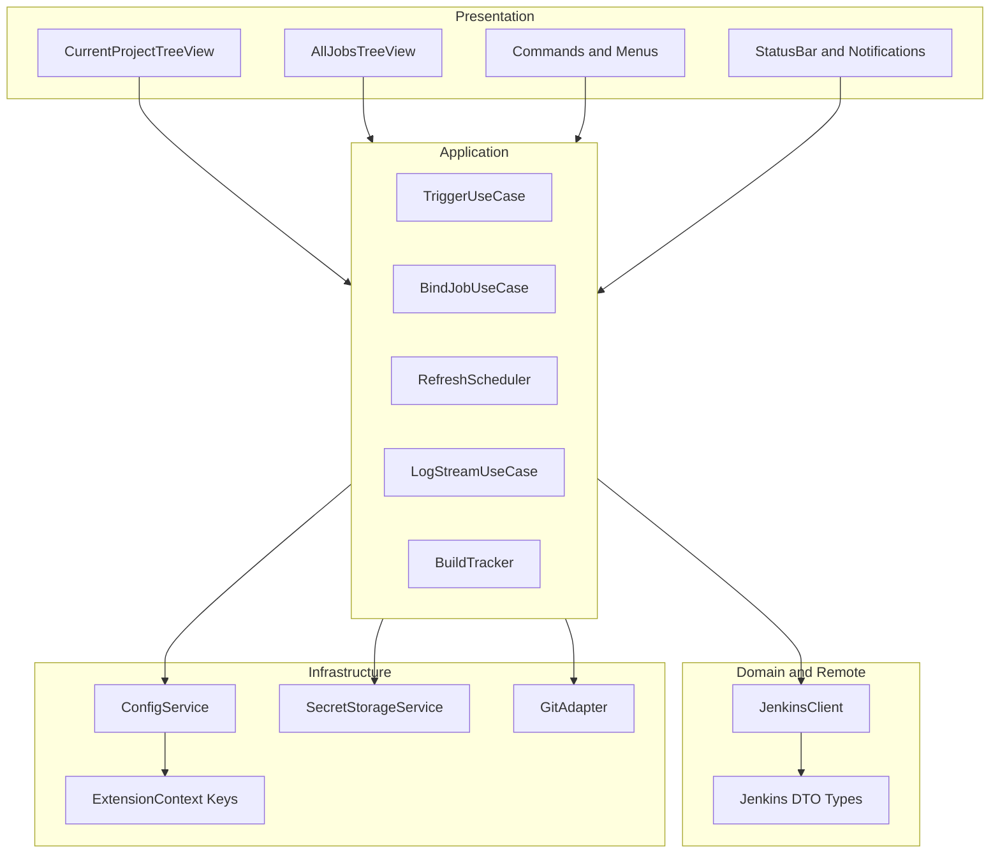
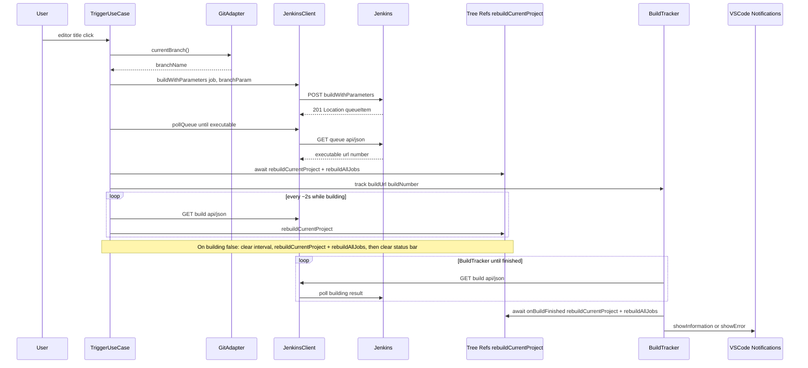

# Jenkins Builder — 技术设计文档

需求与验收见 [PRD.md](./PRD.md)。**侧栏刷新与 Trigger / 构建终态的时序须满足 [PRD §3.6](./PRD.md#36-侧栏刷新与-trigger构建终态的联动问题追溯)。** 本文把 PRD 中的功能映射为可实现的工程结构与模块边界。

## 1. 总体架构（逻辑分层）

插件运行在 **Extension Host** 单进程内，不引入独立后台服务。**仅使用 VSCode stable API**，不启用 `enabledApiProposals`。自上而下分为四层：

- **呈现与交互层（UI Adapter）**：`reactive-vscode` 包装的 Commands、`TreeDataProvider`、编辑器标题栏菜单、`StatusBarItem`、通知、QuickPick/InputBox。只负责触发动作与展示状态，不写 Jenkins URL 拼接细节。
- **应用编排层（Use Cases）**：`triggerCurrentBranch`、`bindProjectJob`、`refreshAllViews`、`openBuildLog`、`stopBuild` 等用例，编排 Git 分支读取、Client 调用、队列轮询、日志 OutputChannel 与通知。
- **领域与远程访问层（Domain + JenkinsClient）**：Jenkins REST 的强类型封装（Job/Build/Queue）、错误归一化、Basic Auth、超时。MVP 使用 API Token，不实现 CSRF Crumb / CookieJar（见第 7 节）。
- **基础设施层（Infra）**：`WorkspaceConfiguration` / `SecretStorage` 读写、全局 `setContext`（`when` 子句）、定时器 `setInterval` 与 `Disposable` 统一回收。

## 2. 建议源码目录结构（落地 antfu/starter-vscode 后）

路径以 `src/` 为根，与 `tsup` 单入口 `index.ts` 导出对齐（具体文件名可按脚手架微调，但职责边界如下）：

- `src/index.ts` — `defineExtension` 入口：**Trigger / BuildTracker 须遵守 [PRD §3.6](./PRD.md#36-侧栏刷新与-trigger构建终态的联动问题追溯) 与本文 §4.1**，在可执行 build 就绪后、构建终态确定后均主动 `rebuildCurrentProject` / `rebuildAllJobs`，不得仅依赖 `refreshIntervalSec`。
- `src/config.ts` — 封装 `jenkinsBuilder.`* 配置的读取；`baseUrl`/`username` 来自 `workspace.getConfiguration`，token 只走 `SecretStorage`。
- `src/context-keys.ts` — 集中维护 `vscode.commands.executeCommand('setContext', 'jenkinsBuilder.signedIn', boolean)`、`jenkinsBuilder.hasProjectJob` 等，避免散落魔法字符串。
- `src/git.ts` — 薄封装 `extensions.getExtension('vscode.git')`：返回当前 workspace folder 的 HEAD 分支名；失败时向上抛带用户文案的错误。
- `src/jenkins/types.ts` — `JobSummary`、`BuildInfo`、`QueueItem`、`JenkinsError` 子类（`UnauthorizedError`/`ForbiddenError`/`NotFoundError`/`TimeoutError`/`NetworkError`）。
- `src/jenkins/url.ts` — 纯函数 `fullNameToUrlPath(fullName)`：`fullName.split('/').map(s => 'job/' + encodeURIComponent(s)).join('/')`；以及 `buildApiJson(buildUrl)`、`progressiveTextUrl(buildUrl, start)` 等纯拼接，便于 vitest 单测。
- `src/jenkins/proxy.ts` — 代理解析与 undici `ProxyAgent` 工厂。纯函数 `resolveProxy()` 按 `jenkinsBuilder.proxy` > `http.proxy` > `HTTPS_PROXY`/`HTTP_PROXY` 环境变量优先级合并；`parseNoProxy` / `shouldBypassProxy` 处理 `NO_PROXY`；`maskProxyUrl` 用于日志；`buildDispatcher` 通过可注入的 loader 动态加载 `undici`（运行时由 Electron 内置提供，不打包）。详见 §4.1 代理。
- `src/jenkins/client.ts` — `JenkinsClient` 类：`fetchJson`、`postForm`、`buildWithParameters`、`pollQueueUntilExecutable`、`getJobBuilds(jobFullName, { limit })`（用 `tree=builds[number,result,timestamp,duration,actions[causes[userName]]]{0,N}`）、`stopBuild`、`getProgressiveText(buildUrl, start)`；所有方法统一 Basic Auth、可配置超时（`AbortController`，默认 10s）与 HTTP→`JenkinsError` 子类的归一化处理；可选注入 undici `dispatcher` 与 `noProxy` 列表，请求匹配 `noProxy` 后跳过 dispatcher 直连；`NetworkError` 携带 `cause.code`/`cause.message` 便于排查（`ECONNREFUSED` / `ENOTFOUND` / `UNABLE_TO_VERIFY_LEAF_SIGNATURE` 等）。**不引入 CookieJar**：API Token 视作已认证，直接跳过 CSRF Crumb（见第 7 节）。
- `src/views/current-project-provider.ts` — `TreeDataProvider`：根节点为「Bind…」占位或已绑定 Job；子节点为最近 N 次 build；实现 `getChildren` 懒加载与图标映射（`color` → ThemeIcon）。
- `src/views/all-jobs-provider.ts` — `TreeDataProvider`：根 jobs 仅请求一次 `GET /api/json?tree=jobs[name,fullName,url,color,_class]`，folder 节点（`_class` 含 `Folder`）通过 `getChildren` 懒加载。**不缓存全量树**。搜索走服务端 `GET /search/suggest?query=<kw>` 拿候选 fullName，再用 QuickPick 展示；根 jobs 数量 > 200 时 TreeView 截断展示前 200 + 一条 `Use Search…` 提示节点。
- `src/services/build-tracker.ts` — 维护 `Map<buildUrl, { notified: boolean }>`：对 Trigger 产生的 build 轮询 `GET .../build/api/json` 直到 `building === false`；**在标记已消费终态之后、`showInformationMessage` / `showErrorMessage` 之前**，`await deps.onBuildFinished?.()`，用于立即刷新 TreeView（对齐 PRD §3.6 问题二）。再按 `jenkinsBuilder.notifyOnFinish` 决定是否弹通知。
- `src/services/log-stream.ts` — 为指定 build 创建/复用 `OutputChannel`：用 `progressiveText?start=<offset>` 增量拉取，根据响应头 `X-Text-Size` 推进 `offset`，`X-More-Data: true` 时继续轮询、否则停止。打开同一 build 的新流时先 dispose 上一个轮询，禁止并发。
- `src/services/refresh-scheduler.ts` — 读取 `refreshIntervalSec`，`Disposable` 管理 `setInterval` 唤醒 TreeView 的 `refresh` 事件源；订阅 `onDidChangeConfiguration('jenkinsBuilder.refreshIntervalSec')` **热重启**定时器。
- `src/ui/status-bar.ts` — `StatusBarController`：左侧 item 显示登录态（点击触发 Sign In/Out），右侧 item 仅在 Trigger 进行中时创建，build 终态时 dispose。

## 3. 模块职责与对外接口（摘要）

| 模块                       | 职责                                                                                        | 主要依赖                                                  | 产出的用户可感知行为            |
| ------------------------ | ----------------------------------------------------------------------------------------- | ----------------------------------------------------- | --------------------- |
| `ConfigService`          | 合并 User/Workspace 配置；解析 `projectJob` full name                                            | `vscode.workspace`                                    | Trigger 参数名、刷新间隔、通知策略 |
| `SecretStorageService`   | `apiToken` 存取；登出清空                                                                        | `context.secrets`                                     | Sign In/Out           |
| `JenkinsClient`          | 一切 HTTP；统一 Basic Auth + 10s 超时；HTTP 错误归一化为 `JenkinsError` 子类（401/403/404/Timeout/Network） | `fetch`/`undici`                                      | 与 Jenkins 的所有交互       |
| `StatusBarController`    | 左侧登录态 item + 右侧 Trigger 进度 item                                                           | `vscode.window`                                       | 状态栏可视反馈               |
| `CurrentProjectProvider` | 展示绑定 Job 与 builds                                                                         | `JenkinsClient`、`ConfigService`                       | View A                |
| `AllJobsProvider`        | Folder 懒加载 + 搜索建议                                                                         | `JenkinsClient`                                       | View B                |
| `TriggerUseCase`         | 读分支 → `buildWithParameters` → 队列 → 可执行 URL                                                | `GitAdapter`、`JenkinsClient`                          | 编辑器按钮 + 状态栏           |
| `BuildTracker`           | 完成态检测 + 去重通知；`**onBuildFinished` 先于通知刷新双 Tree**                                           | `JenkinsClient`、`notifyOnFinish`、`onBuildFinished` 回调 | 成功/失败 Toast（不阻塞侧栏终态）  |
| `LogStreamService`       | OutputChannel 日志流                                                                         | `JenkinsClient`                                       | 查看控制台日志               |
| `RefreshScheduler`       | 定时刷新                                                                                      | `Configuration`、Tree `fire`                           | 自动刷新                  |

## 4. 核心序列：Trigger 到通知（与 PRD §3.6 对齐）

以下顺序为**硬约束**：侧栏数据刷新不得排在阻塞型通知之后。

### 4.1 实现落点（`src/index.ts` 现状约定）

| 步骤  | 行为                                                                                                                                                                                                                                                    |
| --- | ----------------------------------------------------------------------------------------------------------------------------------------------------------------------------------------------------------------------------------------------------- |
| A   | `pollQueueUntilExecutable` 返回后，**立刻** `await rebuildCurrentProject()` + `await rebuildAllJobs()`（PRD §3.6 问题一）。                                                                                                                                       |
| B   | `setInterval`（约 2s）：先 `getBuildApi`；若 `building`，`await rebuildCurrentProject()`；若 **非 building**，`clearInterval`，清 `triggerBusy` / `triggerLabel`，**再** `await rebuildCurrentProject()` + `await rebuildAllJobs()`，然后 `return`（终态优先刷树，PRD §3.6 问题二）。 |
| C   | `BuildTracker`：注册 `BuildTrackerDeps.onBuildFinished` 为双树刷新（与 B 中终态分支一致）；在 `track()` 内检测到 `building === false` 并去重后，**先 `await onBuildFinished()`，再**执行通知相关逻辑（`showInformationMessage` / `showErrorMessage`）。                                          |

**禁止**：仅在 `refreshIntervalSec` 定时器触发后才更新 Trigger 相关构建在侧栏的展示（可作为补充，不能是唯一路径）。

### 4.1 代理（Electron 39+/Node 22 undici fetch 强约束）

**背景**：Cursor 3.4.x 起将 Electron 升至 39.x，宿主 Node 升至 22.x。Node 22 内置的全局 `fetch`（undici 实现）**不再**自动读取 VSCode 的 `http.proxy` 设置，也**不再**读取 `HTTPS_PROXY` / `HTTP_PROXY` 环境变量。这导致旧版本里"什么都不配也能跑通"的企业代理用户在升级后统一表现为 `fetch failed`。

**实现约束**：

1. 任何走 `fetch` 的 Jenkins 请求都必须经由 `JenkinsClient`，由 `JenkinsClient` 在 `init.dispatcher` 上注入 undici `ProxyAgent`（来自 `src/jenkins/proxy.ts` 的 `buildDispatcher`）。
2. 代理 URL 解析优先级（最高优先在前）：`jenkinsBuilder.proxy` > VSCode `http.proxy` > 进程环境变量 `HTTPS_PROXY` / `https_proxy` / `HTTP_PROXY` / `http_proxy`。任一为空白字符串视为未设置。
3. `NO_PROXY` / `no_proxy` 支持精确主机、点前缀（`.example.com`）后缀匹配与 `*` 通配；命中时该请求跳过 dispatcher 直连。
4. TLS 校验：`jenkinsBuilder.strictSSL`（boolean，可空）覆盖 `http.proxyStrictSSL`；同时作用于 `requestTls.rejectUnauthorized` 与 `proxyTls.rejectUnauthorized`（保证代理握手也按配置校验）。
5. `undici` 在 `tsdown.config.ts` 标记为 external，运行时由 Electron 自带的 Node 22 提供，不打入 `dist/index.cjs`。
6. 配置变更：`onDidChangeConfiguration` 监听 `jenkinsBuilder.proxy` / `strictSSL` / `requestTimeoutMs` 以及 `http.proxy` / `http.proxyStrictSSL`，命中后 `await refreshClientFromSecrets()` 重建 `JenkinsClient` 再 `refreshAll()`。
7. 故障定位：`NetworkError` 必须把 undici 抛出的 `error.cause.code` / `error.cause.message` 透传到错误消息（如 `fetch failed (ECONNREFUSED: ...)`、`fetch failed (UNABLE_TO_VERIFY_LEAF_SIGNATURE)`），并在 `Output Channel` 中以 `logger.info` 输出当前代理 URL（凭证已 mask）与来源（`extension` / `vscode` / `env` / `none`）。

## 5. `package.json` contributes 与代码映射

- `contributes.commands`：每个命令字符串在 `index.ts` 中对应一个 `useCommand('id', handler)`，handler 只调 UseCase，不直接 `fetch`。
- `contributes.viewsContainers.activitybar` + `views`：`id` 与 `TreeDataProvider` 注册时的 viewId 一致；`Bind Jenkins Job…` 可用虚拟树节点 `command` 字段绑定 `jenkinsBuilder.bindJob`。
- `contributes.menus.editor/title`：`jenkinsBuilder.triggerCurrentBranch` + `when` 子句依赖 `setContext` 维护的 `jenkinsBuilder.signedIn`、`jenkinsBuilder.hasProjectJob`。
- `contributes.configuration`：与 [PRD 第 5 节配置项汇总](./PRD.md#5-配置项汇总) 一一对应，`SecretStorage` 中的 token 不在此声明。

## 6. 并发、取消与资源生命周期

- 扩展 `deactivate` 时：`RefreshScheduler.dispose()`、所有 `OutputChannel.dispose()`、进行中的 `AbortController` 中止未完成的 `fetch`。
- 同一 build 的日志流请求：后续打开应停止前一个轮询，避免重复定时器。
- TreeView 展开并发：子节点请求加 simple mutex 或 `latestRequestId`，防止慢请求覆盖快请求导致 UI 闪回旧数据。
- **登录状态机**：
  - `activate()` 读 SecretStorage：若 token 存在则乐观 `setContext jenkinsBuilder.signedIn=true`，并在后台异步 `GET /me/api/json` 校验；401 时回退 `signedIn=false` 并 `showWarning('Jenkins token expired, please sign in again.')`。
  - 用户从未登录过 → `signedIn=false`，View A 渲染"Sign in to continue"占位。
- **配置变更监听**：
  - `onDidChangeConfiguration('jenkinsBuilder.projectJob')` → 重新计算 `hasProjectJob` 并 `currentProjectProvider.fire()`。
  - `onDidChangeConfiguration('jenkinsBuilder.refreshIntervalSec')` → 通知 `RefreshScheduler` 重启定时器。
  - `onDidChangeConfiguration('jenkinsBuilder.baseUrl' | 'jenkinsBuilder.username')` → 视为登录信息变更，立即重新 `/me` 校验。
- **多窗口并存**：`BuildTracker` 是单 ExtensionHost 内的内存 Map，多窗口同时打开同一项目并各自 Trigger 时不互相去重，可能产生两条通知；本 MVP 不解决。
- **统一 Disposable**：所有 `OutputChannel`、`StatusBarItem`、`Interval` 通过 `defineExtension` 注入的 `context.subscriptions` 管理，禁止模块内自留闭包计时器。

## 7. 安全与可观测性

- **认证模型**：MVP 仅支持 username + API Token。Jenkins 官方将 API Token 视为已认证凭据，POST 时**无需** CSRF Crumb；因此本插件不引入 CookieJar / Crumb 流程。若用户的 Jenkins 强制对 API Token 也校验 Crumb（少数定制实例），不在 MVP 支持范围。
- **日志**：`useLogger('jenkins-builder')` 仅记录 method、url、status、duration；**禁止**打印 Authorization 头或完整 query（参数值可能含敏感信息时打 mask）。
- **Token**：仅 `SecretStorage`；任何 401 触发"清内存 token + `setContext signedIn=false` + 引导重新登录"。
- **reactive-vscode 细节**：`defineExtension` / `useCommand` / `useLogger` 等具体 API 以当前脚手架版本与官方文档为准，实现时以仓库代码为准微调命名。
- **测试**：`jenkins/url.ts` 与错误归一化由 vitest 覆盖；至少包含
  - `fullNameToUrlPath` 对单层 / 多层 / 含特殊字符（空格、`#`）fullName 的输出
  - `BuildTracker`：**须先** `await onBuildFinished()`（刷新双树）**再**弹完成通知，顺序与 PRD §3.6 / 本文 §4 一致
  - HTTP 401/403/404/超时/连接拒绝 → 对应 `JenkinsError` 子类
  对 `vscode` API 的集成测试不作为 MVP 硬性要求。

## 8. 与里程碑的对应关系

| 里程碑 | 主要涉及模块                                                                  |
| --- | ----------------------------------------------------------------------- |
| M1  | `index.ts`、`config.ts`、`SecretStorageService`、`JenkinsClient`（`/me` 校验） |
| M2  | `CurrentProjectProvider`、`BindJobUseCase`、`context-keys`                |
| M3  | `TriggerUseCase`、`GitAdapter`、编辑器菜单、`StatusBarItem`                     |
| M4  | `AllJobsProvider`、folder 懒加载、搜索 QuickPick                               |
| M5  | `LogStreamService`、`stopBuild`、`RefreshScheduler`                       |
| M6  | `README`、图标、`vsce`/`ovsx` 脚本；无新架构模块                                     |
